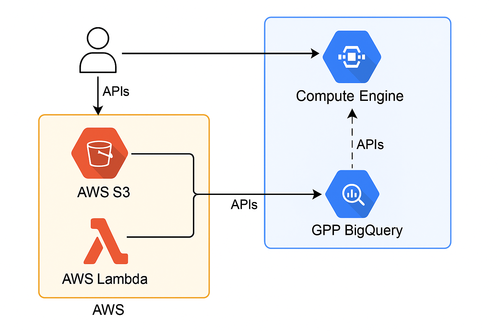

# CodTech Internship – Task 3: Multi-Cloud Architecture

## ✅ Task Overview
This task demonstrates a simulated multi-cloud architecture where services are distributed between **Amazon Web Services (AWS)** and **Google Cloud Platform (GCP)** for better performance, flexibility, and cost optimization.

## 🏗 Architecture Overview
- **AWS S3** – Stores static website files and application assets
- **AWS Lambda** – Processes backend logic and API requests
- **GCP Compute Engine** – Runs the main application server
- **GCP BigQuery** – Stores and analyzes large datasets
- **APIs** – Used to transfer data between AWS and GCP

## 🔄 Workflow
1. User request goes to **GCP Compute Engine**
2. Compute Engine fetches static files from **AWS S3**
3. **AWS Lambda** handles API logic and sends data where needed
4. Data is analyzed and stored in **GCP BigQuery**
5. Processed results are sent back to the user

## 📸 Architecture Diagram

## 🌟 Benefits of Multi-Cloud
- Avoid **vendor lock-in**
- Improve **disaster recovery**
- Optimize **performance** using best services from each provider
- Balance **cost and efficiency**

## ✅ Conclusion
This submission completes Task 3 by simulating a multi-cloud architecture between AWS and GCP, demonstrating service interoperability without requiring paid cloud access.

